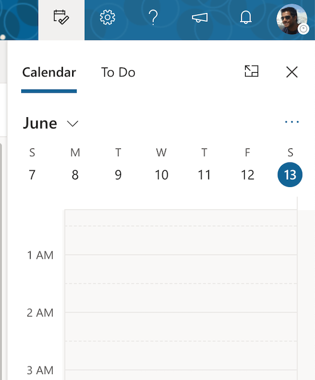

# Outlook Web UXtras

A chrome extension plugin that does provides some specific actions to improve
the UX for the outlook web client.

## Current Features

### Open Calendar Sidebar
It opens the calendar sidebar in `https://outlook.office.com/mail/*`.

### Toggle Request Response in Calendar

**NOTE** This feature *currently* only works when creating a calendar in an external
window.

Currently, there is no way in the outlook settings to turn off `Request
response`.

In order to NOT force meeting attendees to turn off `Email
Organizier` when responding to a calendar invite, this feature allows the
creator of the calendar invite to automatically turn that setting off.

